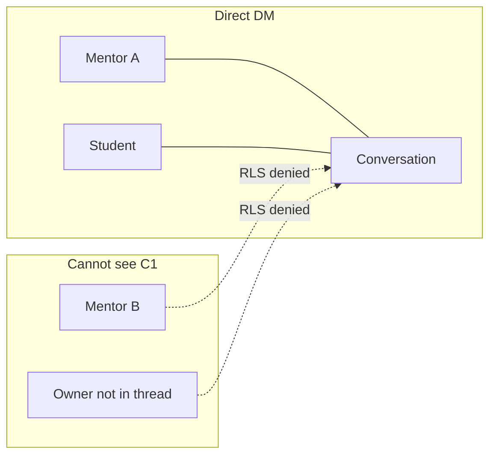

# Mission Brief MB-118
## Private Direct Messaging — Strictly Two Participants

**Status:** Engineering complete — pending Product Owner browser verification  
**Date:** 2026-07-06  
**Shipped:** 2026-07-06 (`ba054e2`)  
**Priority:** Critical — Privacy breach on production (Traders Confidence)  
**Prepared by:** Enterprise Architect  
**Product Owner decision:** Direct messages follow the WhatsApp model — **strictly only the two participants**. No owner override. No other mentors. Groups are opt-in by the creator.

---

## Mission Summary

On Traders Confidence, the workspace owner (Senior Developer) started a direct message to student **Tinashe Nzombe**. Mentor **Bongani Zungu** can see and reply in that thread. That is wrong.

Root cause is structural: the database treats each student as having **one shared direct thread per workspace**, auto-adds **every** `trader_members` row as a member, and RLS allows any workspace mentor to read all conversations and messages via `is_trader_member(trader_id)`.

This brief fixes direct messaging privacy end-to-end: schema, RPCs, triggers, RLS, data repair, and minimal UI/API changes for multi-mentor workspaces.

---

## Business Objective

When a mentor DMs a student (or a student DMs a mentor), **only those two people** can see the thread. The workspace owner has **no special visibility** into other mentors' direct conversations. Group chats include only people the creator explicitly adds (plus students selected for that group).

---

## Evidence (Production DB, Traders Confidence, 2026-07-06)

Direct conversation between owner and Tinashe — **5 members**:

| user | role in thread |
|---|---|
| Senior Developer (owner) | member |
| Bongani Zungu | member |
| TEST MENTOR2 | member |
| traders test | member |
| Tinashe Nzombe | member |

`created_by`: `44213ee5-da12-4d06-a7d9-1601d42e79c3` (owner).

**Expected after fix:** exactly **2** members — creator mentor + Tinashe.

---

## Root Cause

### 1. One direct thread per student (wrong model)

Unique index `conversations_one_direct_thread_per_student` on `(trader_id, direct_student_user_id)` where `type = 'direct'`. All mentors share one thread per student.

### 2. RPCs add all workspace mentors

`create_direct_conversation` (`202606120008` ~588–607):

```sql
insert into public.conversation_members (...)
select ... from public.trader_members member
where member.trader_id = resolved_trader_id
union all
select ... target_student_id ...
```

`create_student_conversation` (EP-054, applied in production) uses the same pattern.

### 3. Trigger auto-adds new mentors to every conversation

`sync_trader_conversation_membership` on `trader_members` INSERT adds the new user to **all** conversations in the workspace — including direct threads.

### 4. RLS too permissive

Policies on `conversations`, `conversation_members`, `messages`, and `message_attachments` include:

```sql
or public.is_trader_member(trader_id)
```

Any mentor can read any conversation in the workspace even if not a member.

### 5. Ad-hoc and student groups also leak to all mentors

`create_group_conversation` (EP-056) and `create_student_group` add all `trader_members` to group conversations. Creator cannot keep a group private.

---

## Expected Behaviour

| Conversation type | Who is a member | Who can read |
|---|---|---|
| **Direct** | Exactly **one mentor + one student** | Only those two (+ super_admin for platform ops) |
| **Group** (messages UI or Student Groups) | Creator + selected students (+ optionally other mentors **only if creator adds them** — future; v1: creator mentor only among mentors) | Only members |
| **Announcement** | All mentors + all verified students (unchanged) | All members |
| **All Students** system group | All mentors + verified students (unchanged) | All members |

**Direct thread identity:** `(trader_id, direct_mentor_user_id, direct_student_user_id)` — one thread per mentor–student pair.

**Owner rule:** Owner is a mentor like any other. Owner sees **only** direct threads they personally participate in. No admin peek into others' DMs.

---

## Architecture Summary



**Defence in depth:**

1. **Membership** — RPCs insert only the two participants for direct.
2. **Triggers** — never auto-add mentors to `type = 'direct'` or non-system groups.
3. **RLS** — read access only via `is_conversation_member()` (plus `is_super_admin()`).

---

## Implementation Scope

### IN scope

1. Migration: add `direct_mentor_user_id`, replace unique index, repair TC data.
2. Replace `create_direct_conversation`, `create_student_conversation`, `create_group_conversation`, `create_student_group` membership logic.
3. Fix `sync_trader_conversation_membership` to scope auto-add to announcement + All Students system group only.
4. Tighten RLS on conversations, conversation_members, messages, message_attachments.
5. API: `student_direct` accepts optional/required `mentorUserId`.
6. UI: student "Message your mentor" — mentor picker when workspace has multiple mentors; single mentor auto-selected.
7. Engineering prompt EP-118 for implementer.

### OUT of scope

- Adding other mentors to ad-hoc groups via UI (v1: creator only among mentors; can follow up).
- Changing announcement broadcast semantics.
- Message encryption or export.
- Super-admin UI to read client DMs (platform ops retain DB access via service role only; no product feature).

---

## Database Changes

**New migration:** `supabase/migrations/202607061400_direct_message_privacy.sql`

### A — Schema

```sql
alter table public.conversations
  add column direct_mentor_user_id uuid references public.profiles(id) on delete set null;

-- Backfill before dropping old index (see Data Repair)
drop index if exists public.conversations_one_direct_thread_per_student;

create unique index conversations_one_direct_thread_per_pair
  on public.conversations (trader_id, direct_mentor_user_id, direct_student_user_id)
  where type = 'direct'
    and direct_mentor_user_id is not null
    and direct_student_user_id is not null;

alter table public.conversations
  add constraint conversations_direct_pair_required
    check (
      type <> 'direct'
      or (direct_mentor_user_id is not null and direct_student_user_id is not null)
    );
```

### B — `create_direct_conversation` (mentor-initiated)

- Set `direct_mentor_user_id = auth.uid()`.
- Upsert on `(trader_id, direct_mentor_user_id, direct_student_user_id)`.
- Insert **exactly two** `conversation_members` rows:
  - mentor (`auth.uid()`, role `owner` or `moderator`)
  - student (`member`)

### C — `create_student_conversation` (student-initiated)

Signature:

```sql
create_student_conversation(
  target_application_id uuid,
  target_mentor_user_id uuid default null
)
```

- Caller must be the verified student on the application.
- Resolve `target_mentor_user_id`:
  - If provided: must be an active `trader_members` row for the workspace.
  - If null and workspace has exactly one mentor/owner: use that user.
  - If null and multiple mentors: `raise exception 'mentor required'`.
- Set `direct_mentor_user_id = target_mentor_user_id`.
- Members: target mentor + student only.

### D — `create_group_conversation`

- Add creator (`auth.uid()`) as the **only** mentor member.
- Add selected verified students.
- Do **not** insert all `trader_members`.

### E — `create_student_group`

- Add creator (`auth.uid()`) as the **only** mentor member on the linked group conversation.
- Do **not** insert all `trader_members`.
- **Exception unchanged:** `ensure_all_students_group` continues to add all mentors (system broadcast group).

### F — `sync_trader_conversation_membership`

On `trader_members` INSERT, add new mentor **only** to:

- `conversations.type = 'announcement'`
- `conversations` linked to `student_groups.system_key = 'all_students'`

Do **not** add to `type = 'direct'` or other groups.

On DELETE, remove from all conversations (existing behaviour is fine).

### G — RLS (replace existing policies)

Drop `is_trader_member` read paths from participant policies. Target shape:

```sql
-- conversations SELECT
using (public.is_super_admin() or public.is_conversation_member(id))

-- conversation_members SELECT
using (public.is_super_admin() or public.is_conversation_member(conversation_id))

-- messages SELECT
using (public.is_super_admin() or public.is_conversation_member(conversation_id))

-- message_attachments SELECT — same via message join
```

Keep `tenant members manage conversations` / `manage conversation membership` for INSERT/UPDATE/DELETE only if still needed for RPC security-definer paths; SELECT must not leak.

Review `profiles` policy `conversation participants read member profiles` — ensure `shares_conversation_with` still works after membership fix (no change expected).

### H — Data repair (Traders Confidence + global)

**Step 1 — Backfill `direct_mentor_user_id` on existing direct threads:**

```sql
update public.conversations c
set direct_mentor_user_id = coalesce(
  (
    select cm.user_id
    from public.conversation_members cm
    join public.trader_members tm
      on tm.user_id = cm.user_id and tm.trader_id = c.trader_id
    where cm.conversation_id = c.id
      and cm.user_id <> c.direct_student_user_id
    order by case when cm.user_id = c.created_by then 0 else 1 end,
             cm.joined_at
    limit 1
  ),
  c.created_by
)
where c.type = 'direct'
  and c.direct_mentor_user_id is null;
```

Prefer `created_by` when that user is a mentor member of the thread; otherwise earliest mentor member.

**Step 2 — Prune illegal direct members:**

```sql
delete from public.conversation_members cm
using public.conversations c
where cm.conversation_id = c.id
  and c.type = 'direct'
  and cm.user_id not in (c.direct_mentor_user_id, c.direct_student_user_id);
```

**Step 3 — Split duplicate direct rows** (if backfill created conflicts after index change):

For any student with multiple mentor relationships that were collapsed into one thread, **do not delete messages**. If pruning alone leaves one thread with mixed history, accept for v1 — going forward new threads are per-pair. Document in deploy notes.

**Step 4 — Verify TC Tinashe thread:**

```sql
select c.id, c.direct_mentor_user_id, c.direct_student_user_id,
       array_agg(cm.user_id order by cm.user_id) as members
from conversations c
join conversation_members cm on cm.conversation_id = c.id
join student_applications sa on sa.student_user_id = c.direct_student_user_id
join portals p on p.trader_id = c.trader_id and p.slug = 'traders-confidence'
where c.type = 'direct'
group by c.id, c.direct_mentor_user_id, c.direct_student_user_id;
```

**Pass:** exactly 2 members; Bongani and other non-participant mentors absent.

---

## Application Changes

### `app/api/messages/conversations/route.ts`

Extend schema:

```typescript
z.object({
  type: z.literal("student_direct"),
  applicationId: z.string().uuid(),
  mentorUserId: z.string().uuid().optional(),
}),
```

Pass `target_mentor_user_id` to RPC.

### `components/messages-workspace.tsx`

**Student side (`startMentorConversation`):**

- If workspace exposes multiple mentors (prop or fetch), show a small mentor picker before POST.
- If exactly one mentor, omit picker and omit `mentorUserId` (RPC auto-resolves).

**Mentor side:** no change to compose flow — each mentor gets their own thread with the student via updated RPC.

### `lib/community-server.ts`

No structural change expected — already loads via `conversation_members` for current user. After RLS fix, stray threads disappear from other mentors' lists.

### Mentor student list / "Message" button

Each mentor's "Message" action creates/opens **their** direct thread, not a shared workspace thread.

---

## Files Expected

| File | Action |
|---|---|
| `supabase/migrations/202607061400_direct_message_privacy.sql` | Create — schema, RPCs, trigger, RLS, repair |
| `app/api/messages/conversations/route.ts` | Edit — `mentorUserId` for `student_direct` |
| `components/messages-workspace.tsx` | Edit — mentor picker for students (multi-mentor) |
| `engineering-prompts/EP-118-direct-message-privacy.md` | Create — implementer checklist |

Optional if mentor list not already available on student messages page:

| File | Action |
|---|---|
| `app/student/messages/page.tsx` | Pass mentor options into `MessagesWorkspace` |
| `lib/community-server.ts` | Return workspace mentors for student context |

---

## Testing Requirements

**Environment:** KaiTrades (acceptance) or TC staging — use two mentor accounts + one student.

### Test 1 — Mentor-initiated direct (primary privacy test)

1. Mentor A → Students → Message Tinashe (or test student).
2. Mentor A sends "private from A".
3. Sign in as Mentor B (same workspace, not in thread).
4. **Pass:** Mentor B does **not** see the thread in Messages list.
5. **Pass:** Direct API/query as Mentor B returns 0 rows / forbidden for that `conversation_id`.

### Test 2 — Owner cannot see other mentor's DM

1. Mentor B → Message same student → send "private from B".
2. Sign in as workspace owner (not Mentor B).
3. **Pass:** Owner sees only their own thread with the student, not Mentor B's.

### Test 3 — Student-initiated (single mentor)

1. Student → Message your mentor → send message.
2. **Pass:** Thread has exactly 2 members (student + that mentor).

### Test 4 — Student-initiated (multi-mentor)

1. Workspace with 2+ mentors.
2. Student clicks Message → **Pass:** mentor picker appears.
3. Select Mentor A → **Pass:** thread created with student + Mentor A only.

### Test 5 — New mentor join does not backfill into old DMs

1. Create direct thread between Mentor A and student.
2. Add new Mentor C to workspace (permanent invite).
3. **Pass:** Mentor C is **not** added to existing direct thread.

### Test 6 — Group conversation privacy

1. Mentor A → New group → select 2 students, do not add Mentor B.
2. **Pass:** Mentor B cannot see the group.

### Test 7 — All Students / announcement unchanged

1. Post to All Students group as any mentor.
2. **Pass:** All mentors still see All Students / announcement channels.

### Test 8 — TC production repair

Run verification query from Data Repair §H Step 4 after migration.

**Pass:** Tinashe owner thread = 2 members; Bongani absent.

---

## Acceptance Criteria

- [x] Direct conversations have exactly **two** members (one mentor, one student)
- [x] Unique per mentor–student pair within a workspace
- [ ] Workspace owner **cannot** read other mentors' direct threads *(PO browser test)*
- [x] RLS denies non-participants on conversations, messages, attachments
- [ ] New mentors are not auto-added to existing direct threads or private groups *(PO browser test)*
- [ ] Student can start DM with chosen mentor in multi-mentor workspace *(PO browser test)*
- [ ] All Students and announcement channels still work for all mentors *(PO browser test)*
- [x] TC Tinashe thread repaired (2 members)
- [x] `npm run build` passes
- [ ] Product Owner confirms on Traders Confidence

---

## Definition of Done

- [x] Migration applied to production Supabase (`jsbpfhfmumjbrnymhtvq`) — via `supabase db query --file` (see ops note below)
- [x] Verification queries pass for TC direct thread (5 → 2 members)
- [ ] Tests 1–8 pass on KaiTrades or TC *(PO after Vercel deploy)*
- [ ] Deployed to Vercel production
- [ ] Product Owner confirms: Bongani cannot see owner's DM to Tinashe

### Ops note — migration history drift

`supabase db push` failed due to remote/local migration history mismatch. Migration was applied directly to production SQL; file `202607061400_direct_message_privacy.sql` is in repo for documentation and fresh environments. Reconcile migration history separately if CLI push is needed again.

---

## Commit message suggestion

```
fix: MB-118 private direct messaging — strictly two participants
```
