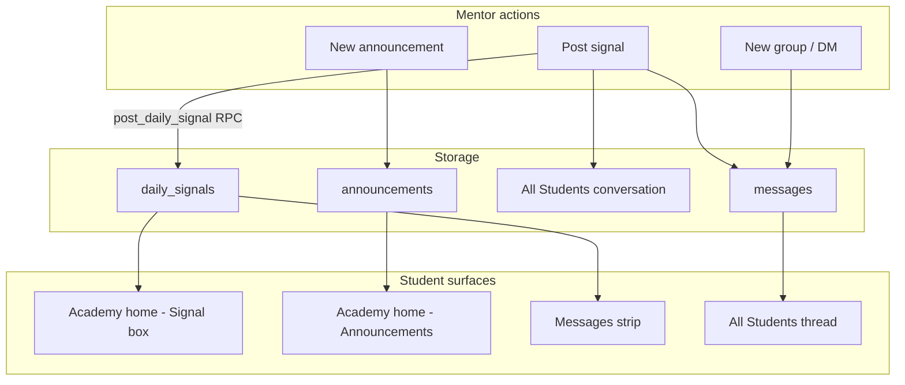

# Mission Brief MB-120
## Signals, Announcements & Group Post Policies — Simple Mentor UX

**Status:** Approved — ready for engineering  
**Date:** 2026-07-07  
**Priority:** High — Messaging UX confusion + MB-118 group regression  
**Prepared by:** Enterprise Architect  
**Product Owner decision:** Split **signals** (daily trade calls) from **announcements** (events/info). Keep group messaging simple. All mentors manage announcements. Signals created from Messages. No new announcement channels in Messages.

**Depends on:** MB-118 (direct DM privacy — shipped). This brief **supersedes** MB-118 group membership rules for ad-hoc groups and updates `can_post_to_conversation` semantics.

---

## Mission Summary

Mentors and students are confused because **trading signals**, **seminar announcements**, and **group chat** live in overlapping places — especially the Messages “announcement channel” flow.

Product Owner approved a **three-lane model**:

| Lane | Purpose | Mentor creates | Student sees |
|---|---|---|---|
| **Signal** | Today’s trade call / setup | **Messages → Post signal** | Academy home signal box + Messages strip + All Students thread |
| **Announcement** | Seminars, events, important non-signal info | **Overview → Announcements** | Academy home announcements section |
| **Chat** | DMs + groups | Messages (unchanged patterns) | Messages |

Additionally fix **MB-118 regression**: secondary mentors cannot post in custom groups because only the group **creator** was added as a mentor member. Custom groups must include **all workspace mentors**; posting rules must be explicit and simple.

---

## Business Objective

Give mentors a **low-friction** workflow:

- Post a signal once → it appears everywhere students expect it.
- Post events/news as announcements without mixing them with signals.
- Use groups and DMs for conversation without hidden permission bugs.

Students always see **signals and announcements in separate UI blocks** — never one mixed feed.

---

## Problems Today

### 1. Signals mixed with announcements

Student Academy home already reads `announcements` (`app/student/page.tsx`). Some mentors also use Messages announcement channels or All Students for trade ideas. Students cannot tell a **signal** from a **seminar notice**.

### 2. Announcement channels in Messages add complexity

`components/messages-workspace.tsx` exposes **New announcement channel** → `create_announcement_conversation` RPC. PO wants this **removed from the create flow** (no new `type = 'announcement'` conversations).

### 3. MB-118 broke secondary mentor posting in custom groups

`create_group_conversation` (MB-118) adds only the **creator** among mentors:

```214:277:supabase/migrations/202607061400_direct_message_privacy.sql
create or replace function public.create_group_conversation(
  ...
  -- creator only as mentor member; students from target_application_ids
```

Secondary mentors are not members → cannot read/post in groups they should share.

### 4. No mentor UI for Overview announcements

`announcements` table and RLS exist (`is_trader_member` can manage). Student home displays published rows. **No mentor dashboard CRUD** on Overview today (`app/dashboard/page.tsx` has metrics only).

### 5. Post permissions are implicit

`can_post_to_conversation()` allows any member to post except students on `type = 'announcement'` threads. Groups and All Students have **no explicit mentors-only vs everyone policy**.

---

## Expected Behaviour

### Signals

| Rule | Detail |
|---|---|
| Who can post | Any active `trader_members` mentor |
| Create flow | Messages → **Post signal** (primary button; not a new conversation type) |
| Fields | Title (required, ≤ 120 chars) + body (required) |
| On submit | Single RPC atomically: (1) insert message in **All Students** conversation, (2) upsert **today’s highlighted signal** for workspace |
| Dashboard highlight | New signal **replaces** prior highlight for the same calendar day (workspace timezone — see §Timezone) |
| Thread history | Previous signal messages **remain** in All Students thread (do not delete) |
| Manual alternative | Mentors may still type directly in All Students; signal button is the shortcut that also updates Academy home + strip |
| Student Messages strip | Read-only **Today’s signal** preview; tap opens All Students thread scrolled to message (or expanded modal — engineer’s choice if scroll is hard) |
| Student Academy home | Dedicated **Signal for today** card **above** Announcements section |
| Announcements on strip | **No** — strip is signal-only |

### Announcements

| Rule | Detail |
|---|---|
| Who can manage | **All mentors** (`trader_members`) — create, edit, publish, unpublish, pin, delete |
| Create flow | **Overview** → Announcements panel → New announcement |
| Content | Seminars, platform maintenance, holidays, general academy news — **not** daily trade signals |
| Student placement | Existing Academy home **Announcements** section (keep; improve layout if needed) |
| Messages | **No** announcement strip; optional text link “View announcements on Academy home” is acceptable, not required v1 |
| Status | Reuse existing `announcements.status` (`draft` / `published`) and `is_pinned` |

### Messages — conversation types

| Type | Members | Default post policy | Policy changes |
|---|---|---|---|
| **Direct** | Exactly 2 (mentor + student) — MB-118 | Both participants | N/A |
| **All Students** (system group) | All mentors + all verified students | **Mentors only** | Any mentor may toggle **Allow student replies** |
| **Custom group** | All mentors + selected verified students | **Mentors only** | **Only group creator** may toggle **Allow student replies** |
| **Announcement** (legacy) | Existing rows only | Mentors only | **Do not create new**; hide from UI |

**Allow student replies** = `post_policy = 'everyone'` (students who are members can post). Default = `post_policy = 'mentors_only'`.

At **custom group creation**, show checkbox: **Allow students to post** (default off). Maps to initial `post_policy`.

### Student Groups dashboard page

**In scope:** Keep `/dashboard/groups` for cohort/course entitlements (`student_groups`, `content_access_grants`).  
**Out of scope:** Removing custom student groups or merging with Messages UI.  
**Rule:** Do not add UI to create a second All Students group (system group already exists via `ensure_all_students_group`).

---

## Architecture Summary



---

## Implementation Scope

### IN scope

1. Migration: `daily_signals` table + `post_daily_signal` RPC.
2. Migration: `conversations.post_policy` enum column + update `can_post_to_conversation`, message insert guard, group RPCs.
3. Migration: `create_group_conversation` — add **all** `trader_members` as mentor members; accept optional `post_policy`.
4. Migration: `sync_trader_conversation_membership` — add new mentors to **all group conversations** (including custom groups and All Students), **never** to `type = 'direct'`.
5. Migration: backfill `post_policy = 'mentors_only'` on all existing group + announcement conversations.
6. API: `POST /api/signals` (or RPC-only from server action — prefer thin API route).
7. API: `GET /api/signals/today?traderId=` for student/mentor strip widget.
8. API: CRUD routes for mentor announcements (`/api/announcements` or extend existing if present).
9. UI: Remove **New announcement channel** from `messages-workspace.tsx`; add **Post signal** modal + mentor strip (optional preview).
10. UI: Overview announcements manager on `app/dashboard/page.tsx` (list + create/edit/publish).
11. UI: Student Academy home — **Signal for today** section above announcements.
12. UI: Student Messages — today’s signal strip.
13. UI: Custom group create — **Allow students to post** checkbox; creator-only policy toggle in group header (mentor mode).
14. UI: All Students — any mentor can toggle allow student replies (group settings affordance in thread header or All Students row).
15. Engineering prompt **EP-120**.

### OUT of scope

- KaiTrades signal templates, charts, or attachments on signals (plain text v1).
- Push notifications / email for signals or announcements.
- Deleting or migrating legacy `type = 'announcement'` conversation rows (leave readable; hide create).
- Removing `/dashboard/groups` or student groups entitlements.
- Signal history page (thread history in All Students is sufficient v1).
- Super-admin signal moderation UI.

---

## Database Changes

**New migration:** `supabase/migrations/202607071200_signals_announcements_post_policy.sql`

### A — Post policy enum

```sql
create type public.conversation_post_policy as enum ('mentors_only', 'everyone');

alter table public.conversations
  add column post_policy public.conversation_post_policy not null default 'mentors_only';
```

Backfill: all existing rows → `mentors_only`.

### B — Update `can_post_to_conversation`

Replace body logic:

- Caller must be a `conversation_members` row and conversation not archived.
- If `post_policy = 'everyone'` → any member may post.
- If `post_policy = 'mentors_only'` → caller must satisfy `is_trader_member(trader_id)`.
- Legacy `type = 'announcement'` → treat as `mentors_only` (students read-only).

Ensure `send_message` / insert path calls this function (existing pattern in `202606120008`).

### C — `daily_signals`

```sql
create table public.daily_signals (
  id uuid primary key default gen_random_uuid(),
  trader_id uuid not null references public.traders(id) on delete cascade,
  signal_date date not null,
  title text not null check (char_length(title) <= 120),
  body text not null,
  message_id uuid not null,
  conversation_id uuid not null,
  created_by uuid not null references public.profiles(id) on delete restrict,
  created_at timestamptz not null default now(),
  unique (trader_id, signal_date),
  foreign key (message_id, trader_id)
    references public.messages(id, trader_id) on delete cascade,
  foreign key (conversation_id, trader_id)
    references public.conversations(id, trader_id) on delete cascade
);
```

RLS:

- Mentors: `is_trader_member(trader_id)` — select all; insert/update via RPC only.
- Verified students: select where `has_verified_access(trader_id)`.

Index: `(trader_id, signal_date desc)`.

### D — `post_daily_signal` RPC

Signature:

```sql
post_daily_signal(
  target_title text,
  target_body text
) returns uuid  -- daily_signals.id
```

Steps (single transaction):

1. Resolve `trader_id` from `current_trader_id()`; reject if null.
2. Resolve All Students conversation id via `ensure_all_students_group` → `conversations` where `group_id` matches and `type = 'group'`.
3. Insert `messages` row (reuse existing message insert helper / same validation as API).
4. Upsert `daily_signals` on `(trader_id, signal_date)` — **on conflict update** title, body, message_id, conversation_id, created_by, created_at.
5. Return `daily_signals.id`.

**Signal date:** `signal_date = (now() at time zone coalesce(portal.timezone, 'UTC'))::date` — join portal via trader if timezone column exists; else UTC.

### E — `create_group_conversation`

Update signature:

```sql
create_group_conversation(
  target_title text,
  target_application_ids uuid[],
  target_post_policy public.conversation_post_policy default 'mentors_only'
)
```

Membership:

1. Insert conversation with `post_policy = target_post_policy`.
2. Insert **all** `trader_members` for workspace as `owner`/`moderator` (creator = `owner`, others = `moderator`).
3. Insert selected verified students as `member`.

### F — `create_student_group` linked conversation

When creating the parallel group conversation, same rule: **all mentors** as members (not creator-only). Default `post_policy = 'mentors_only'`.

### G — `set_conversation_post_policy` RPC

```sql
set_conversation_post_policy(
  target_conversation_id uuid,
  target_post_policy public.conversation_post_policy
)
```

Authorization:

- Caller must be `is_trader_member(trader_id)`.
- If conversation linked to `student_groups.system_key = 'all_students'` → **any mentor** may update.
- Else if `type = 'group'` → only `conversations.created_by = auth.uid()`.
- Else → reject.

### H — `sync_trader_conversation_membership`

On `trader_members` INSERT, add user to:

- All Students system group conversation
- Legacy `type = 'announcement'` conversations (unchanged)
- **All** `type = 'group'` conversations in workspace (including custom groups)

**Never** add to `type = 'direct'`.

### I — Deprecate create announcement RPC (soft)

- Revoke/grant unchanged is fine; **remove API/UI call sites**.
- Optional comment in migration: `create_announcement_conversation` deprecated — do not call from app.

---

## API Changes

| Route | Method | Purpose |
|---|---|---|
| `/api/signals` | POST | Mentor posts signal (calls `post_daily_signal`) |
| `/api/signals/today` | GET | Today’s signal for workspace (student + mentor strip) |
| `/api/announcements` | GET, POST | Mentor list/create |
| `/api/announcements/[id]` | PATCH, DELETE | Edit, publish, pin, delete |

Validate mentor session via existing workspace helpers. Student GET for `/api/signals/today` requires verified access to trader.

Remove `type: "announcement"` branch from `app/api/messages/conversations/route.ts` (or return 410 with message to use Overview announcements).

---

## UI Changes

### Mentor — Messages (`components/messages-workspace.tsx`)

| Change | Detail |
|---|---|
| Remove | **New announcement channel** button and create modal |
| Add | **Post signal** button (prominent; e.g. chart/trend icon + label) |
| Add | Modal: title + body → POST `/api/signals` → toast success → refresh All Students if open |
| Add | Optional compact “Today’s signal” preview for mentors (same data as students) |
| Update | `canPost` logic: respect server-side post policy (disable composer + helper text when read-only) |
| Add | Group header menu: **Allow student replies** toggle (creator-only except All Students) |

Copy for read-only student in mentors-only thread:

> Only mentors can post in this conversation.

### Mentor — Overview (`app/dashboard/page.tsx`)

Add **Announcements** panel (third column or below metrics):

- List published + drafts (title, status, pinned, date)
- **New announcement** → modal/slide-over (title, body, publish now / save draft, pin)
- Edit / unpublish / delete inline actions
- Empty state: “Share seminars and important updates — not daily trade signals. Use Messages → Post signal for those.”

### Student — Academy home (`app/student/page.tsx`)

1. Fetch today’s signal (`daily_signals` for `trader_id` + today’s date) alongside announcements.
2. Render **Signal for today** section **above** Announcements when signal exists.
3. Show title, body (truncate with expand if long), timestamp.
4. Empty state: omit section (no placeholder noise).

### Student — Messages (`app/student/messages/page.tsx` + workspace)

- Top strip: today’s signal preview + link to All Students conversation.
- Update page description copy — remove “mentor announcements” wording; reference signals + groups.

### Legacy announcement conversations

- If existing `type = 'announcement'` threads remain in list, show badge **Legacy** or rename display to “Announcements (archive)” — read-only for students.
- Do not delete rows in v1.

---

## Timezone

Use portal timezone when available on `portals` or trader settings; fallback **UTC**. Document chosen column in EP-120. Same date key for mentor re-post “replace today’s highlight”.

---

## Testing Requirements

**Environment:** KaiTrades or staging workspace with **two mentors** + **two verified students**.

### Test 1 — Post signal fan-out

1. Mentor A → Messages → Post signal (“EURUSD long”, body text).
2. **Pass:** Row in `daily_signals` for today.
3. **Pass:** Message appears in All Students thread.
4. **Pass:** Student Academy home shows Signal for today (not under Announcements).
5. **Pass:** Student Messages strip shows same signal.

### Test 2 — Signal replace same day

1. Mentor B posts second signal same day.
2. **Pass:** Dashboard/strip show **latest** signal only.
3. **Pass:** Both messages remain in All Students history.

### Test 3 — Announcement separate

1. Mentor A → Overview → New announcement (“Seminar Saturday”).
2. **Pass:** Appears in student Announcements section only — **not** in signal box or signal strip.

### Test 4 — Secondary mentor group posting (regression)

1. Mentor A creates custom group with Student 1.
2. Mentor B (not creator) opens group.
3. **Pass:** Mentor B is a member and can post (mentors-only policy).

### Test 5 — Mentors-only vs everyone

1. Create group with default (mentors only).
2. **Pass:** Student member cannot post.
3. Creator enables Allow student replies.
4. **Pass:** Student can post.
5. Non-creator mentor tries to change policy on custom group.
6. **Pass:** Forbidden.
7. Any mentor toggles policy on All Students.
8. **Pass:** Allowed.

### Test 6 — New mentor sync

1. Create custom group with Mentors A + students.
2. Add Mentor C to workspace.
3. **Pass:** Mentor C auto-added to All Students + custom group, **not** to any direct DM.

### Test 7 — No new announcement channels

1. Mentor Messages UI.
2. **Pass:** No “New announcement channel” button.
3. API POST `type: announcement` → **Pass:** rejected.

### Test 8 — Direct DM unchanged (MB-118)

1. Direct thread still exactly 2 members; other mentors cannot see.

### Test 9 — Build

`npm run build` passes.

---

## Acceptance Criteria

- [ ] **Post signal** in Messages creates All Students message + today’s `daily_signals` row
- [ ] Student Academy home shows **separate** Signal and Announcements sections
- [ ] Student Messages strip shows **signal only** (not announcements)
- [ ] All mentors can CRUD **announcements** from Overview
- [ ] **No** new announcement channel creation in Messages
- [ ] Custom groups include **all workspace mentors** at creation
- [ ] `post_policy` enforced: mentors-only default; optional student replies
- [ ] All Students policy editable by **any mentor**; custom group policy editable by **creator only**
- [ ] Secondary mentor can post in groups (Test 4)
- [ ] MB-118 direct DM privacy preserved (Test 8)
- [ ] Product Owner confirms on live workspace

---

## Definition of Done

- [ ] Migration applied to production Supabase (`jsbpfhfmumjbrnymhtvq`)
- [ ] EP-120 completed and referenced in commit
- [ ] Tests 1–9 pass
- [ ] Deployed to Vercel production
- [ ] Product Owner sign-off

---

## Mentor cheat sheet (for help/docs copy)

| I want to… | I do… |
|---|---|
| Send today’s trade idea | Messages → **Post signal** |
| Announce a seminar or event | Overview → **New announcement** |
| Chat privately with one student | Messages → Direct message |
| Discuss with a cohort | Messages → **New group** |
| Broadcast long-form in thread only | Write in **All Students** (signal button also updates dashboard) |

---

## Commit message suggestion

```
feat: MB-120 signals, overview announcements, and group post policies
```
