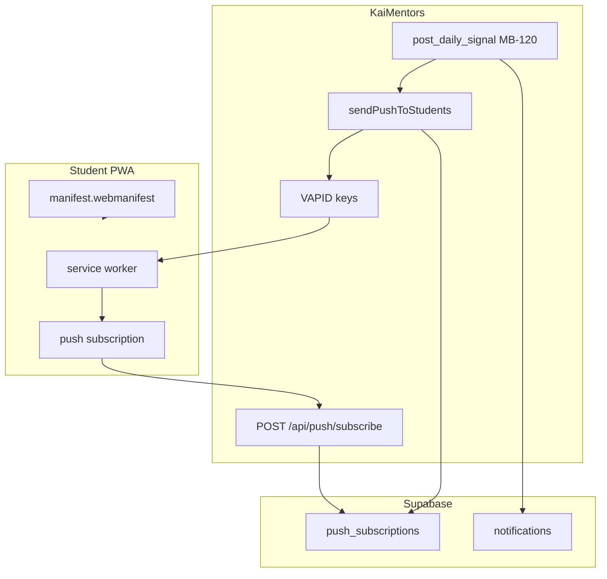

# Mission Brief MB-121
## PWA — Add to Home Screen + Signal Push Notifications

**Status:** Approved — ready for engineering  
**Date:** 2026-07-07  
**Priority:** High — Product Owner committed to 100% PWA path (no App Store wrapper v1)  
**Prepared by:** Enterprise Architect  
**Product Owner decision:** Ship **Progressive Web App** install experience on iOS and Android. Include **real push notifications** when a mentor posts a **daily signal**. White-label per academy (portal name + logo on home screen icon).

**Depends on:** MB-120 (`post_daily_signal` RPC — push fan-out hooks into signal publish). PWA shell (manifest, service worker, install UI) may ship **before** MB-120; signal push **requires** MB-120 signal publish path.

---

## Mission Summary

Students and mentors should use KaiMentors like a **native app** — icon on the phone home screen, full-screen experience, no App Store download — while the product remains the **same Next.js web app**.

When a mentor posts **today’s signal** (MB-120), verified students who opted in receive a **system push notification** on their phone (lock screen / notification shade), not only the in-app bell.

---

## Business Objective

| Goal | Detail |
|---|---|
| **Installable** | Add to Home Screen on iOS (Safari) and Android (Chrome) |
| **Branded** | Installed icon/name = **portal name** + logo on custom domains |
| **Signal alerts** | Push when mentor posts/replaces daily signal |
| **Simple** | One web codebase; updates deploy instantly with Vercel |
| **No store friction** | No App Store / Play Store listing in v1 |

---

## What the User Experiences

### Install (student or mentor)

**Android (Chrome):** Browser may show **Install app**. Tap → icon on home screen.

**iPhone (Safari):** Share → **Add to Home Screen** → icon uses academy name + logo.

Opening the icon launches **standalone** (no URL bar) at the academy login or last visited route.

### Push (verified students)

1. Student installs PWA (or uses site in browser — push works best after Home Screen install on iOS).
2. Student sees prompt: **Turn on signal alerts** (after verified home load or after standalone detect).
3. Student allows notifications.
4. Mentor posts signal → phone shows:

   > **Traders Confidence**  
   > **Signal: EURUSD long**  
   > Tap to view

5. Tap opens Academy home or Messages / All Students (engineer choice — prefer Messages with All Students selected).

---

## Platform Constraints (honest)

| Platform | Install | Web push for signals |
|---|---|---|
| **Android Chrome** | Install banner + menu | Full support |
| **iOS Safari (16.4+)** | Manual Add to Home Screen | Push **only after** Home Screen install; user must grant permission |
| **iOS in-browser tab** | N/A | Push **not** reliable — prompt should say “Add to Home Screen first” on iOS |
| **Desktop** | Optional install | Push supported Chrome/Edge — low priority v1 |

Engineering must **not** promise push for iOS users who never Add to Home Screen. Install helper copy must say this clearly.

---

## Architecture Summary



**Dual delivery on signal publish:**

1. **In-app** — existing `notifications` row + bell realtime (extend type `daily_signal`).
2. **Web Push** — `web-push` to all matching `push_subscriptions` for verified students in that workspace.

---

## Current Codebase (starting point)

| Area | Status |
|---|---|
| PWA manifest | **Missing** — no `manifest.json` / `app/manifest.ts` |
| Service worker | **Missing** |
| Web push | **Missing** |
| In-app notifications | **Exists** — `lib/notifications.ts`, `components/notification-bell.tsx`, `/api/notifications`, Supabase realtime on `notifications` table |
| Portal branding | **Exists** — `portals.portal_name`, `logo_path`, `primary_color` |
| White-label metadata | **Exists** — `portalTitle()` in `lib/metadata.ts` |
| Signal publish | **MB-120** — `post_daily_signal` RPC (not shipped yet) |

---

## Implementation Scope

### IN scope

#### A — PWA install shell

1. Dynamic **web app manifest** per request context (portal-aware on custom domains).
2. **Apple meta tags** + `apple-touch-icon` (portal logo or generated icon).
3. **Service worker** registration (scope `/`).
4. **`display: standalone`**, `theme_color` from portal `primary_color`.
5. **Install prompt component** — Android `beforeinstallprompt`; iOS step-by-step instructions.
6. Show install card on **verified student Academy home** and optionally mentor Overview.
7. Detect **standalone mode** — adjust copy / show push prompt when installed.

#### B — Web push infrastructure

1. Migration: `push_subscriptions` table.
2. VAPID key pair — env vars on Vercel (`VAPID_PUBLIC_KEY`, `VAPID_PRIVATE_KEY`, `VAPID_SUBJECT`).
3. `POST /api/push/subscribe` — save subscription (authenticated user).
4. `DELETE /api/push/subscribe` — unsubscribe.
5. Service worker: `push` event → `showNotification`; `notificationclick` → open deep link.
6. Server helper: `sendWebPushToTraderStudents(traderId, payload)` using `web-push` npm package.
7. **Signal hook** — call push helper from `post_daily_signal` (migration trigger or API layer after MB-120 RPC).

#### C — Signal notification content

| Field | Value |
|---|---|
| Title | `{portal_name}` or “New signal” |
| Body | Signal title + truncated body |
| Data URL | `/student/messages` or `/academy/messages` on custom domain + conversation query if available |
| In-app type | `daily_signal` |
| Badge icon | Portal logo URL or default |

Fan-out audience: **verified students** in workspace (`student_applications.status = 'verified'`) who have an active `push_subscriptions` row for the **same origin** they installed from (see §Origin scoping).

#### D — Opt-in UX

1. Component **SignalAlertsPrompt** — “Get notified when your mentor posts a signal.”
2. Show when: verified student + (standalone OR Android) + permission not granted + not dismissed in localStorage.
3. iOS not standalone → show **Install first** mini-guide, then enable alerts.
4. Settings affordance: disable alerts (unsubscribe) in student shell menu v1 or bell area.

#### E — Engineering prompt **EP-121**.

### OUT of scope (v1)

- App Store / Capacitor native wrapper.
- Push for announcements, DMs, or bookings (in-app bell only — can extend later using same `push_subscriptions` table).
- Offline course playback or full offline sync.
- Per-student push preferences beyond on/off.
- Email/SMS fallback for signals.
- Mentor push when student messages.

---

## Database Changes

**New migration:** `supabase/migrations/202607071400_pwa_push_subscriptions.sql`

### `push_subscriptions`

```sql
create table public.push_subscriptions (
  id uuid primary key default gen_random_uuid(),
  user_id uuid not null references public.profiles(id) on delete cascade,
  trader_id uuid references public.traders(id) on delete cascade,
  endpoint text not null,
  p256dh text not null,
  auth text not null,
  origin text not null,
  user_agent text,
  created_at timestamptz not null default now(),
  updated_at timestamptz not null default now(),
  unique (user_id, endpoint)
);

create index push_subscriptions_trader_user_idx
  on public.push_subscriptions (trader_id, user_id);
```

RLS:

- User can **select/insert/update/delete** own rows only (`user_id = auth.uid()`).
- Service role (server push send) bypasses RLS.

### Extend `notifications` (if columns missing)

Ensure `notifications` supports:

- `type` including `daily_signal`
- optional `trader_id`, `conversation_id`, `metadata jsonb` for deep links

Add in-app rows in signal publish path alongside web push (same fan-out list).

### Signal push trigger

**Preferred:** Application layer inside `/api/signals` POST (MB-120) after successful `post_daily_signal`:

1. Resolve verified student user IDs for trader.
2. Insert `notifications` rows (batch).
3. Call `sendWebPushToTraderStudents`.

**Alternative:** Postgres trigger on `daily_signals` INSERT — only if app-layer hook is impractical; app layer preferred for VAPID secrets.

---

## Manifest & Icons

### Dynamic manifest route

**Route:** `app/manifest.webmanifest/route.ts` (or Next.js 15 `app/manifest.ts` with dynamic generation via headers/host).

Resolve portal from:

- Custom domain → existing domain → portal lookup (same as middleware / `getStudentAcademyContext` patterns).
- Platform `/student?portal=slug` → portal slug query.

**Manifest fields:**

```json
{
  "name": "Traders Confidence",
  "short_name": "Traders Conf",
  "description": "Academy portal",
  "start_url": "/student",
  "scope": "/",
  "display": "standalone",
  "background_color": "#ffffff",
  "theme_color": "#111315",
  "icons": [
    { "src": "/api/pwa/icon/192?portal=...", "sizes": "192x192", "type": "image/png" },
    { "src": "/api/pwa/icon/512?portal=...", "sizes": "512x512", "type": "image/png", "purpose": "any maskable" }
  ]
}
```

On custom domains, `start_url` should be `/academy` (middleware rewrites to student routes) — match however students normally land.

### Icon generation

**Route:** `GET /api/pwa/icon/[size]` — render portal logo centered on branded background, or letter avatar from `portal_name`. Cache aggressively (`Cache-Control: public, max-age=86400`).

Link in layouts:

```html
<link rel="manifest" href="/manifest.webmanifest" />
<link rel="apple-touch-icon" href="/api/pwa/icon/180" />
<meta name="apple-mobile-web-app-capable" content="yes" />
<meta name="apple-mobile-web-app-title" content="{portal_name}" />
<meta name="theme-color" content="{primary_color}" />
```

Apply to:

- `app/student/layout.tsx` (dynamic metadata)
- `app/dashboard/layout.tsx` (mentor install)
- Custom domain student/mentor paths via shared helper `getPwaMetadata(portal)`

---

## Service Worker

**File:** `public/sw.js` (or Serwist-generated — engineer’s choice; keep minimal v1).

**Requirements:**

1. `self.addEventListener('push', ...)` — parse JSON payload `{ title, body, icon, url, tag }`.
2. `showNotification` with `tag: daily-signal-{traderId}-{date}` so same-day replace doesn’t spam duplicate shade entries.
3. `notificationclick` — `clients.openWindow(url)`.
4. `install` / `activate` — skip waiting optional for v1.
5. Registration from client component `PwaRegistrar` in student + dashboard shells.

**Next.js note:** Service worker must be served from `public/sw.js` at site root for scope `/`. Do not bundle into `_next` only.

---

## API Routes

| Route | Method | Auth | Purpose |
|---|---|---|---|
| `/api/push/subscribe` | POST | User | Save Web Push subscription JSON + origin + traderId |
| `/api/push/subscribe` | DELETE | User | Remove subscription by endpoint |
| `/api/push/vapid-public-key` | GET | Public | Return public VAPID key for client subscribe |
| `/manifest.webmanifest` | GET | Public | Dynamic manifest |
| `/api/pwa/icon/[size]` | GET | Public | Portal icon PNG |

---

## Client Subscribe Flow

```typescript
// Pseudocode — EP-121
const reg = await navigator.serviceWorker.register("/sw.js");
await navigator.serviceWorker.ready;
const vapid = await fetch("/api/push/vapid-public-key").then(r => r.json());
const sub = await reg.pushManager.subscribe({
  userVisibleOnly: true,
  applicationServerKey: urlBase64ToUint8Array(vapid.publicKey),
});
await fetch("/api/push/subscribe", {
  method: "POST",
  body: JSON.stringify({ subscription: sub.toJSON(), traderId, origin: location.origin }),
});
```

Guard: `Notification.permission`, `'serviceWorker' in navigator`, `'PushManager' in window`.

---

## Integration with MB-120 Signals

When `post_daily_signal` succeeds:

1. **In-app:** For each verified student user_id → `createNotification({ type: 'daily_signal', title, body, traderId, conversationId })`.
2. **Push:** `sendWebPushToTraderStudents({ traderId, title, body, url, icon, tag })`.
3. Update student notification bell handler to navigate on `daily_signal` click (Messages / All Students).

If MB-120 ships first without push, MB-121 adds push in a follow-up commit — no schema conflict.

---

## Origin Scoping

Push subscriptions are tied to **`origin`** (e.g. `https://tradersconfidence.com` vs `https://kaimentors.com`).

When sending signal push for `trader_id`:

- Send to subscriptions where `trader_id` matches **OR** user is verified student of trader (join) **and** subscription origin matches a domain mapped to that portal (optional refinement v1: store `trader_id` on subscribe — **required**).

On subscribe, client passes `traderId` from student shell context — server validates user has verified access to that trader.

---

## UI Copy (PO-approved tone)

**Install card (student home):**

> **Add {Academy Name} to your home screen**  
> Quick access to signals and messages — like an app, no download.  
> [Install] · [How on iPhone]

**Push prompt:**

> **Signal alerts**  
> Get notified when your mentor posts today’s trade signal.  
> [Turn on alerts]

**iOS not installed:**

> On iPhone: open in Safari → Share → **Add to Home Screen**, then turn on alerts.

---

## Environment Variables (Vercel)

| Variable | Purpose |
|---|---|
| `VAPID_PUBLIC_KEY` | Web Push public key |
| `VAPID_PRIVATE_KEY` | Web Push private key (secret) |
| `VAPID_SUBJECT` | `mailto:ops@kaisync.tech` or platform contact |

Generate once per environment (production vs preview can share or split — production keys must be stable or subscriptions invalidate).

---

## Testing Requirements

**Devices required:** Android phone (Chrome) + iPhone (Safari, iOS 16.4+).

### Test 1 — Manifest white-label

1. Open custom domain student login.
2. **Pass:** Manifest `name` = portal name (not KaiMentors).
3. **Pass:** Icon route returns portal logo.

### Test 2 — Android install

1. Chrome → verified student home.
2. **Pass:** Install prompt or menu install works.
3. **Pass:** Opens standalone from home screen icon.

### Test 3 — iOS install

1. Safari → Add to Home Screen.
2. **Pass:** Icon label = academy name.
3. **Pass:** Opens standalone.

### Test 4 — Push subscribe

1. Installed PWA → Turn on signal alerts → Allow.
2. **Pass:** Row in `push_subscriptions`.

### Test 5 — Signal push (requires MB-120)

1. Mentor posts signal.
2. **Pass:** Student phone receives system notification within ~30s.
3. **Pass:** Tap opens Messages / signal context.
4. **Pass:** In-app bell also shows `daily_signal` notification.

### Test 6 — Same-day signal replace

1. Second signal same day.
2. **Pass:** Notification updates or replaces (tag strategy); dashboard shows latest.

### Test 7 — Unsubscribe

1. Student disables alerts.
2. **Pass:** Subscription removed; no push on next signal.

### Test 8 — iOS without install

1. Safari tab only, not Home Screen.
2. **Pass:** UI explains install required; no broken permission loop.

### Test 9 — Build

`npm run build` passes; service worker served in production.

---

## Acceptance Criteria

- [ ] Verified students can **Add to Home Screen** with **portal-branded** name and icon
- [ ] Mentors can install dashboard PWA (same manifest pattern)
- [ ] Service worker registered on student + mentor app shells
- [ ] Students can opt in to **signal push** notifications
- [ ] Posting daily signal (MB-120) sends **Web Push** to opted-in verified students
- [ ] Push tap deep-links into academy Messages / signal context
- [ ] In-app notification bell receives `daily_signal` entries
- [ ] iOS copy correctly guides **Safari → Add to Home Screen** before push
- [ ] Works on custom domain and platform domain
- [ ] Product Owner verified on real Android + iPhone hardware

---

## Definition of Done

- [ ] Migration applied to production Supabase
- [ ] VAPID keys set on Vercel production
- [ ] EP-121 completed
- [ ] MB-120 signal publish wired to push fan-out (or MB-120 + MB-121 ship together)
- [ ] Tests 1–9 pass on physical devices
- [ ] Deployed to Vercel production
- [ ] Product Owner sign-off

---

## Recommended Ship Order

| Step | Deliverable |
|---|---|
| 1 | Manifest + icons + install UI (no push yet) |
| 2 | Service worker + subscribe API + VAPID |
| 3 | Wire push to MB-120 signal publish |
| 4 | PO device verification |

Steps 1–2 can go live before MB-120; step 3 completes “real signal notification behavior.”

---

## Commit message suggestion

```
feat: MB-121 PWA install and signal web push notifications
```
