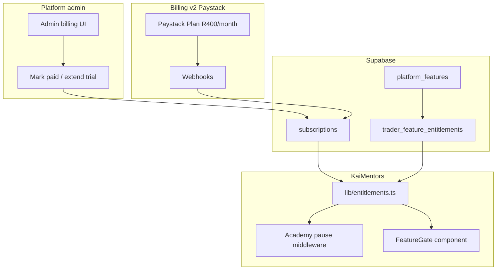

# Mission Brief MB-122
## Platform Subscriptions & Feature Entitlements (Paystack-ready)

**Status:** Approved — ready for engineering  
**Date:** 2026-07-07  
**Priority:** High — commercial foundation before premium trading features  
**Prepared by:** Enterprise Architect  
**Product Owner decision:** KaiMentors is **subscription-based**. Base platform **R400/month (ZAR)**. Existing live mentors **free until 31 July 2026**. New mentors get **30-day free trial from go-live** (not account creation). **Paystack** is the payment provider for SA + Africa expansion. **Feature entitlements** framework ships now; **no paid add-on features yet** — catalog ready for future unlocks (copy trading, OCR, etc.).

**Depends on:** Existing `subscriptions` table and `/admin/traders`, `/admin/subscriptions` pages. Does **not** block current mentor operations — grandfather rule prevents lockout.

---

## Mission Summary

Every mentor workspace runs on a **platform subscription**. If the subscription is not active after trial, the **academy pauses** (mentor paywall + student maintenance message). No half-broken state.

Separately, a **feature entitlement** system lets the platform owner show future premium capabilities as **locked previews** until the mentor pays (or starts a **30-day feature trial** — future phase). **v1 ships the framework only** — no add-on features in catalog yet.

**Billing phases:**

| Phase | When | How |
|---|---|---|
| **v1 — Manual** | Deploy MB-122 → **31 Jul 2026** | Platform admin marks paid / extends trial in admin UI |
| **v1 — First billing** | **1 Aug 2026** | Existing mentors must be `active` (R400) or academy pauses |
| **v2 — Paystack** | After v1 stable | Automated R400/month Plan + Subscription + webhooks |

---

## Business Objective

| Goal | Detail |
|---|---|
| **Recurring revenue** | R400/month per mentor workspace (ZAR, South Africa) |
| **Fair trials** | 30 days free from **go-live** — full working academy, not while custom site is being built |
| **Grandfather existing mentors** | All live mentors free until **31 July 2026** — no surprise lockout on deploy |
| **Future add-ons** | Optional extras stack on the bill; visible as locked until subscribed (later briefs) |
| **Africa-first payments** | Paystack (ZAR now; NG/GH/KE/CI later) — not Stripe for SA entity v1 |
| **Platform control** | Super-admin sees every mentor’s subscription + can override trials and status |

---

## Commercial Rules (PO-approved)

### Base platform — **KaiMentors Standard**

| Field | Value |
|---|---|
| Price | **R400 / month** (ZAR) |
| Currency | South African Rand |
| Payment provider (v2) | **Paystack** |
| What it includes | All current platform features (courses, students, messages, signals, announcements, bookings, live classes, community, PWA, custom domain portal) |

### Existing mentors (live before MB-122 cutover)

| Rule | Detail |
|---|---|
| Free period | **Now → 31 July 2026** (inclusive) |
| Status | `trialing` with `trial_ends_at = 2026-07-31T23:59:59+02:00` |
| Features | **All current functionality enabled** — no locks |
| From **1 Aug 2026** | Must be `active` (R400 paid) or academy **pauses** |

### New mentors (after MB-122)

| Rule | Detail |
|---|---|
| Trial start | **`go_live_at`** — when academy is marked live / custom site published |
| Trial duration | **30 days** from go-live |
| After trial | R400/month or academy pauses |
| Custom site mentors | Trial does **not** start at account creation — only at **go-live** |

### Future add-on features (out of scope for MB-122 v1)

When a feature ships (e.g. copy trading):

| Rule | Detail |
|---|---|
| Default state | **Preview (locked)** — all mentors see it exists |
| Trial | **30 days free** when mentor opts in |
| After trial | Pay add-on price or **lock again** |
| Bill | Stacks: R400 base + add-ons |

**No add-on features are in catalog for MB-122 v1.**

---

## What the User Experiences

### Platform admin (super-admin)

1. **`/admin/traders`** — list mentors; link to **Billing & access** drawer/page per mentor.
2. Per mentor:
   - Subscription status: `trialing` / `active` / `past_due` / `cancelled`
   - Go-live date, trial ends, period end
   - Plan: `platform_standard` (R400)
   - Actions: **Mark paid**, **Extend trial**, **Suspend**, **Set go-live**
   - Grandfather badge if `trial_ends_at = 2026-07-31`
3. **`/admin/subscriptions`** — enhanced table (fix column names to match schema).

### Mentor — subscription active or trialing

- Full dashboard and student academy work as today.
- **Settings → Billing** (new): plan name, status, trial days left, next payment date.
- v1: “Pay R400/month via EFT” instructions + “Contact support when paid”.
- v2: **Pay with Paystack** button → hosted checkout / card on file.

### Mentor — subscription lapsed (`past_due` / `cancelled` after trial)

- Dashboard shows **subscription required** screen — cannot access academy tools.
- Copy: “Your KaiMentors subscription is inactive. Renew for **R400/month** to restore your academy.”
- v2: Paystack checkout to reactivate.

### Student — mentor subscription inactive

- Student portal shows **maintenance / unavailable** — not a broken 500.
- Copy: “This academy is temporarily unavailable. Please contact your mentor.”
- Login still works; content gated.

### Future — locked feature preview (framework only in v1)

When add-ons exist later:

> **Copy trading** — R???/month  
> [Start 30-day free trial]  
> Preview screenshot / description

MB-122 ships `<FeatureGate>` component; no features use it until a future brief adds catalog entries.

---

## Architecture Summary



**Two independent gates:**

1. **Platform subscription** — is the whole academy on? (`isAcademyActive`)
2. **Feature entitlement** — is this specific capability unlocked? (`hasFeature`) — v1 always `true` for built-in features

---

## Current Codebase (starting point)

| Area | Status |
|---|---|
| `subscriptions` table | **Exists** — `plan_key`, `status`, `current_period_ends_at`, `provider_*` columns |
| `subscription_status` enum | `trialing`, `active`, `past_due`, `cancelled` |
| `/admin/subscriptions` | **Exists** — read-only; **wrong column names** (`plan`, `current_period_end`) |
| `/admin/traders` | **Exists** — no billing controls |
| Paystack | **Not integrated** |
| Feature entitlements | **Missing** |
| Academy pause gate | **Missing** |
| Mentor billing UI | **Missing** |

---

## Implementation Scope

### IN scope — v1 (manual billing + entitlements foundation)

#### A — Database

**New migration:** `supabase/migrations/202607081200_platform_subscriptions_entitlements.sql`

1. Extend `subscriptions`:
   - `go_live_at timestamptz` — when academy went live (trial start anchor)
   - `trial_ends_at timestamptz` — explicit trial end
   - `billing_provider text` — `manual` | `paystack` (default `manual`)
   - `paystack_customer_code text`, `paystack_subscription_code text` (nullable, v2)
   - `currency text not null default 'ZAR'`
   - `monthly_amount_cents integer not null default 40000` — R400.00
   - Fix/rename: ensure `plan_key` default `platform_standard`

2. New table `platform_features`:
   - `key text primary key` — e.g. `copy_trading`
   - `name`, `description`, `addon_price_cents`, `currency`, `is_active boolean`
   - v1: **empty or seed zero rows** (optional internal test feature disabled)

3. New table `trader_feature_entitlements`:
   - `trader_id`, `feature_key`, `state` enum: `hidden` | `preview` | `trialing` | `active` | `expired`
   - `trial_ends_at`, `enabled_at`, `updated_by`
   - unique `(trader_id, feature_key)`

4. **Grandfather backfill:**
   ```sql
   -- All existing traders with active portals: trialing until 2026-07-31
   update subscriptions set
     status = 'trialing',
     trial_ends_at = '2026-07-31 23:59:59+02',
     plan_key = 'platform_standard',
     currency = 'ZAR',
     monthly_amount_cents = 40000
   where trader_id in (select id from traders where ...);
   ```

5. RPC or view: `is_academy_active(target_trader_id)` — returns true if:
   - `status in ('trialing', 'active')` AND (`trial_ends_at is null OR trial_ends_at > now()`) AND (`current_period_ends_at is null OR current_period_ends_at > now()` for active)
   - Simpler v1: `trialing`/`active` and `coalesce(trial_ends_at, current_period_ends_at, far_future) > now()`

#### B — Server helpers

**New file:** `lib/entitlements.ts`

```typescript
isAcademyActive(traderId): boolean
getSubscriptionSummary(traderId): { status, trialEndsAt, daysLeft, ... }
hasFeature(traderId, featureKey): boolean  // v1: true for all non-catalog features
getFeatureState(traderId, featureKey): 'hidden' | 'preview' | 'trialing' | 'active' | 'expired'
```

#### C — Academy pause gate

1. **Mentor dashboard** layout/middleware: if `!isAcademyActive` → render `<SubscriptionRequired>` instead of children (except billing/settings routes).
2. **Student routes** (`/student`, `/academy`): if mentor inactive → `<AcademyUnavailable>` maintenance page.
3. **API routes** under mentor workspace: return `402 Payment Required` or `403` with clear error when inactive (except billing endpoints).
4. **Super-admin** routes: never gated.
5. **Acceptance-test tenants** (e.g. KaiTrades): configurable bypass via `traders.environment = 'acceptance_test'` OR explicit admin flag — do not pause PO test workspace accidentally.

#### D — Admin UI

1. **`/admin/traders/[traderId]/billing`** or expandable drawer on traders list:
   - Status, go-live, trial ends, period end, R400 plan
   - **Mark paid** → `active`, extend `current_period_ends_at` +30 days
   - **Extend trial** → push `trial_ends_at` forward
   - **Set go-live** → sets `go_live_at`, auto-compute `trial_ends_at = go_live_at + 30 days` for new mentors
   - **Suspend** → `cancelled` or `past_due`
2. Fix **`/admin/subscriptions`** query columns: `plan_key`, `current_period_ends_at`.
3. Audit log entry on each admin billing action.

#### E — Mentor billing UI

1. **`/dashboard/settings?tab=billing`** (or dedicated `/dashboard/billing`):
   - Show plan, status, trial countdown, R400/month
   - v1: EFT / payment instructions (PO provides bank details in copy or env)
   - “I’ve paid — notify support” optional (no auto-activate v1)
   - v2 placeholder: “Pay with Paystack” button (disabled until MB-122b)

#### F — Feature entitlement framework (no add-ons yet)

1. **`<FeatureGate feature="copy_trading" mode="preview">`** component — locked card with upgrade CTA.
2. **No nav items** use FeatureGate in v1 — nothing to gate.
3. Document pattern in EP-122 for future features.

#### G — Engineering prompt **EP-122**.

### IN scope — v2 (Paystack — separate deploy **MB-122b** or Phase 2 of same brief)

1. Paystack **Plan**: `KaiMentors Standard`, **40000 kobo/cents** = R400, interval `monthly`.
2. **Checkout** flow: mentor → Paystack → card authorization → Subscription.
3. **`start_date`** on subscription = `trial_ends_at` for delayed first charge (30-day trial).
4. **Webhook** `/api/webhooks/paystack`:
   - `subscription.create`, `invoice.payment_failed`, `subscription.disable`, etc.
   - Update `subscriptions.status`, `current_period_ends_at`, Paystack codes.
5. Env vars: `PAYSTACK_SECRET_KEY`, `PAYSTACK_PUBLIC_KEY`, `PAYSTACK_WEBHOOK_SECRET`.
6. Mentor **Pay with Paystack** on billing page.

### OUT of scope (v1 + v2 initial)

- Stripe integration
- Add-on feature catalog entries (copy trading, OCR, etc.) — future MBs
- Feature trial “Start 30-day trial” buttons — until features exist
- Automated dunning emails (Paystack handles some in v2)
- Student-facing billing (students never pay KaiMentors — mentors do)
- Multi-currency pricing (ZAR only v1; Africa expansion later)
- VAT invoice generation (manual / accountant v1)

---

## Paystack Configuration (v2 reference)

| Item | Value |
|---|---|
| Plan name | KaiMentors Standard |
| Amount | **40000** (Paystack uses lowest currency unit — cents for ZAR) |
| Interval | monthly |
| Trial | `start_date` = trial end (go-live + 30 days) |
| Webhook URL | `https://kaimentors.com/api/webhooks/paystack` |
| Expected fees | ~2.9% + R1 local cards; ~2% Ozow/Capitec Pay |

PO creates Paystack business account separately — engineering uses API keys when v2 ships.

---

## API Routes

| Route | Method | Auth | Purpose |
|---|---|---|---|
| `/api/admin/subscriptions/[traderId]` | PATCH | Super-admin | Mark paid, extend trial, set go-live, suspend |
| `/api/mentor/billing` | GET | Mentor | Subscription summary for billing page |
| `/api/webhooks/paystack` | POST | Paystack signature | v2 — subscription events |

---

## UI Copy (PO-approved tone)

**Mentor — trial active:**
> **KaiMentors Standard** — R400/month  
> Trial: **{n} days left** (ends {date})  
> Your academy is fully active during your trial.

**Mentor — lapsed:**
> Your subscription is inactive. Renew for **R400/month** to restore your academy and student access.

**Student — paused:**
> This academy is temporarily unavailable. Please check back later or contact your mentor.

**Admin — mark paid:**
> Sets status to **Active** and extends billing period by 30 days.

---

## Environment Variables

| Variable | Phase | Purpose |
|---|---|---|
| `KAIMENTORS_BILLING_EFT_INSTRUCTIONS` | v1 | Bank details shown on mentor billing page (optional) |
| `PAYSTACK_SECRET_KEY` | v2 | Server-side Paystack API |
| `PAYSTACK_PUBLIC_KEY` | v2 | Client checkout |
| `PAYSTACK_WEBHOOK_SECRET` | v2 | Verify webhooks |

---

## Testing Requirements

### Test 1 — Grandfather (existing mentor)

1. Deploy MB-122 with backfill.
2. **Pass:** Traders Confidence (or live mentor) status `trialing`, trial ends **31 Jul 2026**.
3. **Pass:** Full dashboard + student academy work — no pause.

### Test 2 — New mentor go-live trial

1. Admin sets go-live = today for test mentor.
2. **Pass:** `trial_ends_at` = today + 30 days.
3. **Pass:** Academy active.

### Test 3 — Trial expired (manual)

1. Admin sets `trial_ends_at` = yesterday, status `past_due`.
2. **Pass:** Mentor sees subscription required screen.
3. **Pass:** Student sees unavailable page.
4. **Pass:** API returns 402/403 on mentor mutations.

### Test 4 — Mark paid

1. Admin marks paid.
2. **Pass:** Status `active`, `current_period_ends_at` +30 days.
3. **Pass:** Academy restored.

### Test 5 — Super-admin never blocked

1. `/admin/*` works regardless of mentor subscription state.

### Test 6 — Acceptance tenant bypass

1. KaiTrades (if `acceptance_test`) remains active for CI/PO testing OR explicit admin override documented.

### Test 7 — FeatureGate (smoke)

1. Render test page with `<FeatureGate feature="test_feature" mode="preview">` — shows locked card (no production nav change).

### Test 8 — Build

`npm run build` passes.

### Test 9 — Paystack (v2 only)

1. Test mode checkout → webhook → `active`.
2. Failed payment → `past_due` → academy pauses.

---

## Acceptance Criteria

- [ ] All **existing live mentors** grandfathered free until **31 July 2026**
- [ ] **New mentors** trial starts at **go-live**, lasts **30 days**
- [ ] **R400 ZAR** documented as base plan (`platform_standard`)
- [ ] Admin can **mark paid**, **extend trial**, **set go-live**, **suspend** per mentor
- [ ] **Academy pauses** when subscription inactive (mentor + student UX)
- [ ] **Feature entitlement tables + helpers** exist; no production features gated yet
- [ ] `<FeatureGate>` component ready for future add-ons
- [ ] `/admin/subscriptions` uses correct schema columns
- [ ] Mentor **Billing** page shows status and trial countdown
- [ ] EP-122 completed
- [ ] Paystack v2 documented and env vars listed (implementation may follow in MB-122b)
- [ ] Product Owner confirms no lockout of current mentors on deploy

---

## Definition of Done

- [ ] Migration applied to production Supabase
- [ ] Grandfather backfill verified for all live mentors
- [ ] Tests 1–8 pass
- [ ] Deployed to Vercel production **before 1 Aug 2026**
- [ ] PO confirms Traders Confidence (and other live mentors) active through July
- [ ] Paystack account created by PO (parallel — not blocking v1 deploy)
- [ ] MB-122b Paystack automation scheduled after v1 manual billing validated in August

---

## Recommended Ship Order

| Step | Deliverable | Target |
|---|---|---|
| 1 | Migration + entitlements helpers + grandfather backfill | ASAP |
| 2 | Academy pause gate (mentor + student) | ASAP |
| 3 | Admin billing controls | Before 1 Aug |
| 4 | Mentor billing page (manual EFT copy) | Before 1 Aug |
| 5 | `<FeatureGate>` + EP-122 | With step 1–4 |
| 6 | Paystack checkout + webhooks (MB-122b) | Aug/Sep 2026 |

---

## Future add-on pattern (for later briefs)

When shipping e.g. **copy trading**:

1. Insert `platform_features` row (`copy_trading`, price TBD).
2. Default all mentors → `preview`.
3. Wrap UI in `<FeatureGate feature="copy_trading">`.
4. “Start 30-day trial” → `trialing` for 30 days → Paystack add-on plan or manual enable.
5. API routes check `hasFeature('copy_trading')`.

---

## Commit message suggestion

```
feat: MB-122 platform subscriptions and feature entitlements (manual billing v1)
```

Paystack follow-up:

```
feat: MB-122b Paystack subscription billing and webhooks
```
